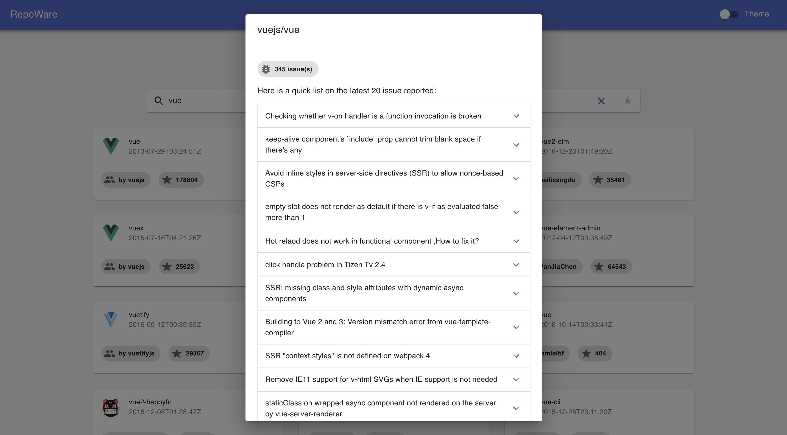

# RepoWare

[](https://app.netlify.com/sites/confident-almeida-f0b35b/deploys)

A simple react client for Github's graphQL API 🚀

In short, this project allows you to browse repositories available on Github using an infinite scroll. It uses the new Github GraphQL v4 and well the new `apollo/client` library.

### Built With

- [React](https://reactjs.org/)
- [Typescript](https://www.google.com/search?q=typescrpt+official+docs&oq=typescrpt+official+docs+&aqs=chrome..69i57.8137j0j1&sourceid=chrome&ie=UTF-8)
- [Apollo/client](https://www.apollographql.com/docs/react/api/core/ApolloClient/)
- [Material-UI](https://material-ui.com/)

## Getting Started

To get this project running locally, please follow the instructions below. It's also important to note that the app doesn't contain an authentication feature yet. Meaning you will need to generate a private personal token on GitHub and add it to the `.env` file.

### Steps to generate your Github personal token:

1. Verify your email address, if it hasn't been verified yet.
2. In the upper-right corner of any page, click your profile photo, then click Settings.
3. In the left sidebar, click Developer settings.
4. In the left sidebar, click Personal access tokens.
5. Click Generate a new token.
6. Give your token a descriptive name.
7. Add your token to the `.env` file (use the `.env.example` for reference)

After following the steps above, please use the `.env.example` as an example to store your token.

```bash
git clone https://github.com/JadRizk/repoWare.git

cd repoWare/

yarn -or- npm  i

yarn start or npm run start
```

Open your localhost on port [3000](http://localhost:3000) to the project running the browser.

## Available Scripts

Here is a list of useful scripts available:

```bash
// Run the dev server locally
yarn start -or- npm run start

// Build the production file
yarn build -or- npm run build

// Run tests
yarn test -or- npm run test

// Format the code using prettier
yarn format -or- npm run format

// Lint Code using ESLint
yarn lint -or- npm run lint
```

## Features

### Search Github repositories by title


### List the 20 latest issues



### Dark Mode Support


### Infinite Scroll


## Roadmap

### Bug fixes

- [ ] Fix the 'no repo found' error. Happening when the value is being debounced
- [ ] When scrolling for more repos and issues concerning duplicate keys is being displayed (Investigate)
- [ ] Handle error state in issueDialog (Enhancements)

### Optimizations

- [ ] Refactor the update query to use type policies
- [ ] Optimize the card skeleton loader to display the amount needed to cover the screen
- [ ] Replace material-ui classes by styles-components

### Future Features

- [ ] ADD AUTOMATED TESTS !

- [ ] Add user authentication using Github REST API (we can get the token and then use it to query the graphql endpoint)
- [ ] Add a feature to allow the user to star or watch repos from the app (Use optimistic UI)
- [ ] Add Infinite Scroll for the issues list
- [ ] Add the option to filter by a minimum amount of stars
- [ ] Add a view to display the top 10 repos for specific languages
